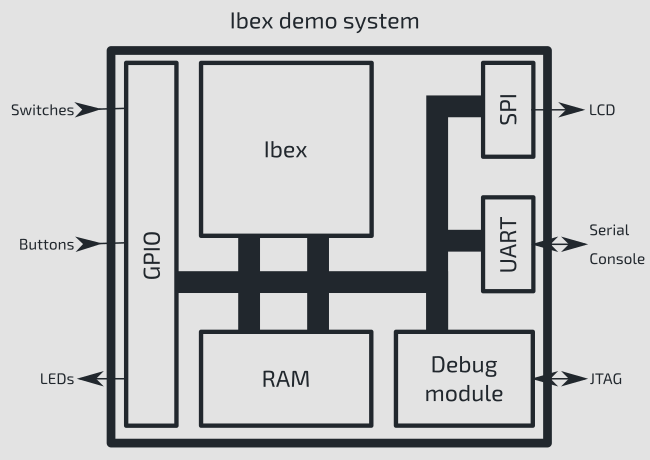
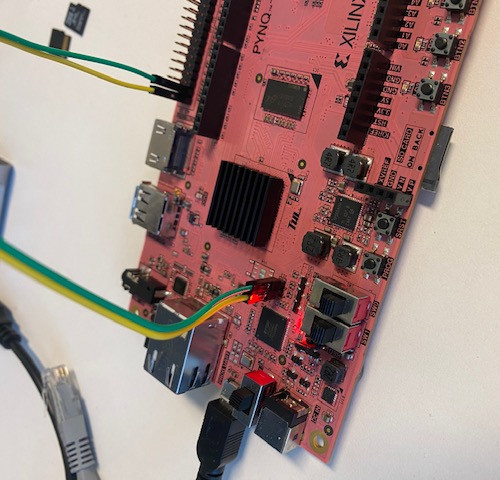

# Ibex Demo System - Pynq-Z2



This an example RISC-V SoC targeting the Pynq-Z2 FPGA board. It is originally forked from the [Pynq-Z2 port](https://github.com/nuntipat/ibex-demo-system/tree/port-pynqz2) of the [Ibex Demo System](https://github.com/lowRISC/ibex-demo-system). It implements the
[lowRISC Ibex core](https://www.github.com/lowrisc/ibex) along with the
following features:

* RISC-V debug support: using the [PULP RISC-V Debug Module](https://github.com/pulp-platform/riscv-dbg)
* UART: connected to pins 40 (TX) and 38 (RX) of the Raspberry Pi Header
* GPIO: 5 inputs (3 push buttons + 2 DIP switches), and 8 outputs (4 LEDs + 4 PMODA) 
* PWM: 6 outputs ( 2 RGB LEDs)
* SPI: Arduino header
* A basic peripheral to write ASCII output to a file and halt simulation from software

BTN3 is used as a reset button.  Because the board has a 125 MHz clock source rather than the Arty board's 100 MHz, a new clock generator module is given in `rtl/fpga/clkgen_pynqz2.sv` based on `vendor/lowrisc_ibex/shared/rtl/fpga/xilinx/clkgen_xil7series.sv`.

Debug can be used via the USB connection to the Pynq-Z2 board (`ttyUSB0`). No external JTAG probe is required.

## Installation Instructions

### Python Requirements 

Start by installing the Python requirements. Best to use a Python environment for this.

```
conda create --name ibex python=3.9
conda activate ibex
pip3 install -U -r python-requirements.txt
```

### Vivado

Tested with **Vivado 2020.2**, available from: https://www.xilinx.com/support/download.html. Requires additional installation of Pynq-Z2 board files. 

Source Vivado suite:
```
source /opt/Xilinx2020.2/Vivado/2020.2/settings64.sh
```

### RISC-V Compiler Toolchain 

Tested with lowRISC toolchain `lowrisc-toolchain-rv32imcb-20230811-1.tar.xz`, available from: https://github.com/lowRISC/lowrisc-toolchains/releases

Instructions:

```
cd /opt
wget https://github.com/lowRISC/lowrisc-toolchains/releases/download/20230811-1/lowrisc-toolchain-gcc-rv32imcb-20230811-1.tar.xz
sudo tar -xf lowrisc-toolchain-gcc-rv32imcb-20230811-1.tar.xz
sudo mv lowrisc-toolchain-gcc-rv32imcb-20230811-1 lowrisc-toolchain
sudo chown -R user:user /opt/lowrisc-toolchain
```

Add to path:
```
export PATH="/opt/lowrisc-toolchain/bin:$PATH"
```

### CMake

The current software fails to build when using the (old) CMake from Ubuntu 20.04. 

The new can be installed as follows (used master branch in October 2023):

```
sudo git clone https://github.com/Kitware/CMake
sudo chown -R user:user /opt/CMake
cd CMake
mkdir build && cd build
../bootstrap && make
```

Add to path:

```
export PATH="/opt/CMake/build/bin:$PATH"
```
### OpenOCD

The version recommended is 0.11.0, which is newer than the one from Ubuntu 20.04. Install this version locally (note: v0.12 doesn't seem to work with the current .cfg file)

```
sudo apt install libusb-1.0-0 libusb-1.0-0-dev libftdi1-2 libhidapi-hidraw0 libjaylink0 libjim0.79 libusb-0.1-4

sudo apt install automake autoconf build-essential texinfo libtool libftdi-dev libusb-1.0-0-dev

cd /opt
sudo git clone https://github.com/openocd-org/openocd 
sudo chown -R user:user /opt/openocd-code

git checkout tags/v0.11.0

./bootstrap
./configure
make
```

Add to path:
```
export PATH="/opt/openocd/src:$PATH"
```

#### Verilator 

The newest version fails when building the simulator. It seems **v5.002** works fine.

```
sudo apt-get install git help2man perl python3 make
sudo apt-get install g++  # Alternatively, clang
sudo apt-get install libgz  # Non-Ubuntu (ignore if gives error)
sudo apt-get install libfl2  # Ubuntu only (ignore if gives error)
sudo apt-get install libfl-dev  # Ubuntu only (ignore if gives error)
sudo apt-get install zlibc zlib1g zlib1g-dev  # Ubuntu only (ignore if gives error)

sudo apt-get install ccache  # If present at build, needed for run
sudo apt-get install mold  # If present at build, needed for run
sudo apt-get install libgoogle-perftools-dev numactl

sudo apt-get install perl-doc

sudo apt-get install git autoconf flex bison

cd /opt
sudo git clone https://github.com/verilator/verilator -b v5.002
mv verilator verilator_5.002
sudo chown -R user:user /opt/verilator_5.002
cd verilator_5.002
autoconf
export VERILATOR_ROOT=`pwd`
./configure
make -j `nproc`
make test
```

Add to path:
```
export PATH="/opt/verilator_5.002/bin:$PATH"
```


### Others

```
sudo apt-get install libelf-dev
sudo apt-get install srecord
sudo apt-get -y install gtkwave

# For gdb to work
sudo apt install -y libncursesw5
```

## Building Software

First the software must be built. This can be loaded into an FPGA to run on a synthesized Ibex processor, or passed to a verilator simulation model to be simulated on a PC.

```
export PATH="/opt/CMake/build/bin:$PATH"
export PATH="/opt/lowrisc-toolchain/bin:$PATH"

mkdir sw/build
pushd sw/build
cmake ../
make
popd
```

Note the FPGA build relies on a fixed path to the initial binary (blank.vmem) so
if you want to create your build directory elsewhere you need to adjust the path
in `ibex_demo_system.core`

## Building Simulation

The Demo System simulator binary can be built via FuseSoC. From the Ibex
repository root run:

```
export PATH="/opt/verilator_5.002/bin:$PATH"

fusesoc --cores-root=. run --target=sim --tool=verilator --setup --build lowrisc:ibex:demo_system
```
## Running the Simulator

Having built the simulator and software, to simulate using Verilator we can use the following command, which targets `./sw/build/demo/hello_world/demo` to run the `demo` binary. 
```
./build/lowrisc_ibex_demo_system_0/sim-verilator/Vibex_demo_system -t --meminit=ram,$(pwd)/sw/build/demo/hello_world/demo

```

Pass `-t` to get an FST trace of execution that can be viewed with
[GTKWave](http://gtkwave.sourceforge.net/).

```
Simulation statistics
=====================
Executed cycles:  5899491
Wallclock time:   1.934 s
Simulation speed: 3.05041e+06 cycles/s (3050.41 kHz)

Performance Counters
====================
Cycles:                     457
NONE:                       0
Instructions Retired:       296
LSU Busy:                   108
Fetch Wait:                 20
Loads:                      53
Stores:                     55
Jumps:                      21
Conditional Branches:       12
Taken Conditional Branches: 7
Compressed Instructions:    164
Multiply Wait:              0
Divide Wait:                0
```

## Building FPGA bitstream
FuseSoC handles the FPGA build. Vivado tools must be setup beforehand. From the repository root:

```
source /opt/Xilinx2020.2/Vivado/2020.2/settings64.sh

fusesoc --cores-root=. run --target=synth --setup --build lowrisc:ibex:demo_system
```

To build for other support development boards such as the NewAE CW305, NewAE CW312-A35, or the TUL PYNQ-Z2, use the command

```
# NewAE CW305
fusesoc --cores-root=. run --target=synth_cw305 --setup --build lowrisc:ibex:demo_system
# NewAE CW312-A35
fusesoc --cores-root=. run --target=synth_cw312a35 --setup --build lowrisc:ibex:demo_system
# TUL PYNQ-Z2
fusesoc --cores-root=. run --target=synth_pynqz2 --setup --build lowrisc:ibex:demo_system
```

## Programming FPGA

To program the FPGA, use the dedicated script. Vivado also works, but then it is important to close the Hardware Manager to release the `ttyUSB0` port.

```
make -C ./build/lowrisc_ibex_demo_system_0/synth_pynqz2-vivado pgm
```

## Loading an application to the programmed FPGA

The util/load_demo_system.sh script can be used to load and run an application. You
can choose to immediately run it or begin halted, allowing you to attach a
debugger.

```bash
# Run demo
./util/load_demo_system.sh pynqz2 run ./sw/build/demo/hello_world/demo
./util/load_demo_system.sh pynqz2 run ./sw/build/demo/lcd_st7735/lcd_st7735

# Load demo and start halted awaiting a debugger
./util/load_demo_system.sh pynqz2 halt ./sw/build/demo/hello_world/demo
```

### UART connection 

There is no direct connection between the FTDI chip and the programming logic (PL) side of the Zynq 7020 SOC used in the PYNQ-Z2 development board. However, we may attach a 2.54mm pin header to J13 (pin 1-left: UART RX, pin 2-right: UART TX) on the board, route the UART signals to any available I/O pins, and make a connection using jumper wires. By default the UART of the Ibex System Demo is in pins 40 (TX) and 38 (RX) of the Raspberry Pi Header 



To view terminal output use screen:

```bash
screen /dev/ttyUSB1 115200
```

## Debugging an application

Either load an application and halt (see above) or start a new OpenOCD instance

```
export PATH="/opt/openocd/src:$PATH"

./util/load_demo_system.sh pynqz2 run ./sw/build/demo/hello_world/demo
```

Then run GDB against the running binary and connect to localhost:3333 as a remote target

```
export PATH="/opt/lowrisc-toolchain/bin:$PATH"

riscv32-unknown-elf-gdb -ex "target extended-remote localhost:3333" ./sw/build/demo/hello_world/demo
```

